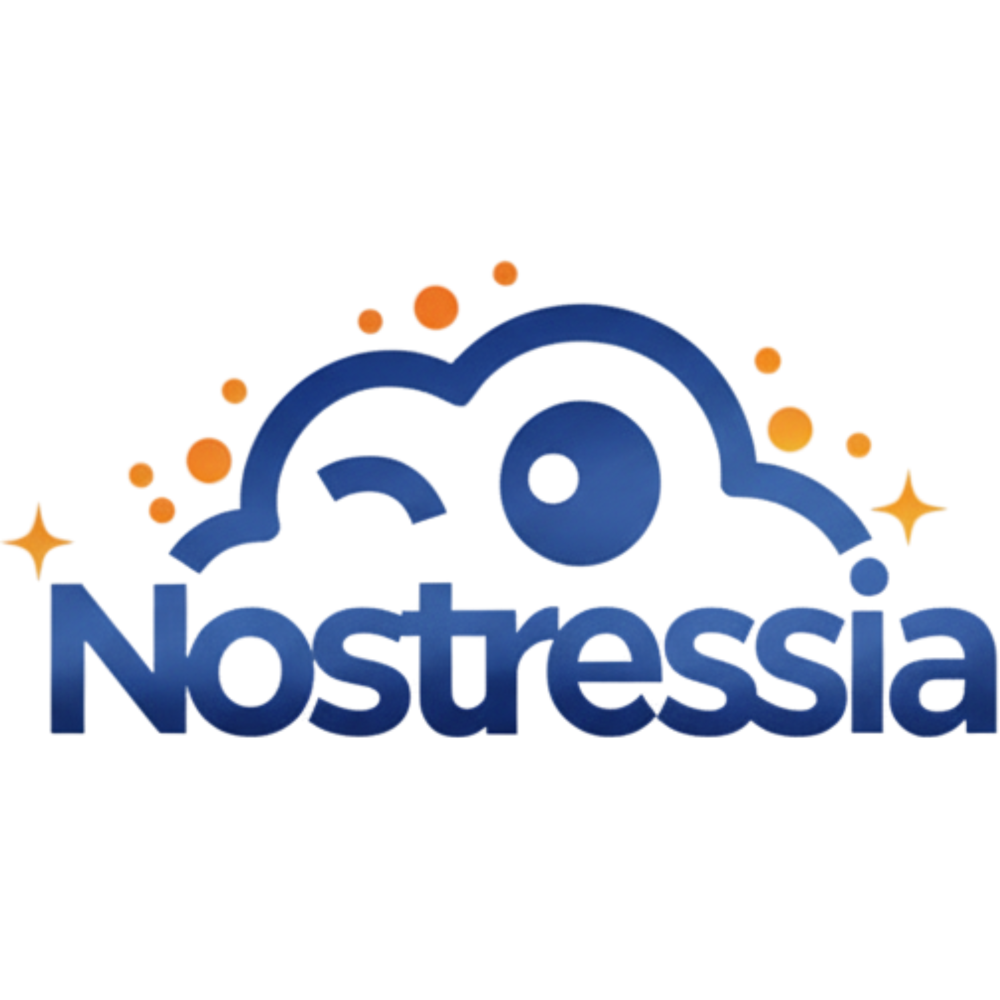

<p align="center">
  
</p>

<h1 align="center">Nostressia Monorepo</h1>

<p align="center">
  <a href="https://www.python.org/" target="_blank" rel="noopener noreferrer">
    
  </a>
  <a href="https://fastapi.tiangolo.com/" target="_blank" rel="noopener noreferrer">
    
  </a>
  <a href="https://react.dev/" target="_blank" rel="noopener noreferrer">
    
  </a>
  <a href="https://vitejs.dev/" target="_blank" rel="noopener noreferrer">
    
  </a>
  <a href="https://scikit-learn.org/" target="_blank" rel="noopener noreferrer">
    
  </a>
  <a href="https://huggingface.co/" target="_blank" rel="noopener noreferrer">
    
  </a>
</p>

<p align="center">
Nostressia adalah ekosistem terintegrasi untuk <b>monitoring stres</b>, <b>analitik perilaku</b>, dan <b>prediksi machine learning</b>.
Monorepo ini menggabungkan frontend, backend API, dan pipeline ML agar pengembangan, testing, dan deployment tetap sinkron.
</p>

---

## 🎯 Tujuan Repository

Repository ini dirancang untuk:

- Menyediakan satu source of truth untuk aplikasi Nostressia (FE + BE + ML).
- Menjaga konsistensi kontrak data antara aplikasi dan model prediksi.
- Mempermudah onboarding developer dengan dokumentasi dan template environment yang seragam.
- Mendukung workflow pengembangan lokal, CI/CD, dan deployment berbasis container/cloud.

---

## 🧩 Arsitektur Sistem (High-Level)

```text
User (Web Browser)
        │
        ▼
Frontend (React + Vite)
        │   HTTP/JSON
        ▼
Backend API (FastAPI)
   ├── Auth, Diary, Stress Log, Analytics, Notification
   ├── Azure Blob Storage integration
   ├── Push Notification scheduling
   └── ML Inference endpoints
        │
        ├────────► ML Artifacts (joblib + metadata)
        │
        └────────► MySQL Database (app + training data)
                         │
                         ▼
            ML Training Pipeline (notebooks + runner)
```

---

## 📦 Komponen Utama

| Komponen | Lokasi | Fungsi |
|---|---|---|
| Frontend | `nostressia-frontend/` | UI aplikasi, routing, form, visualisasi data, notifikasi web |
| Backend | `nostressia-backend/` | REST API, autentikasi, business logic, scheduler, storage, endpoint ML |
| Machine Learning | `nostressia-machine-learning/` | Notebook eksperimen/training, pipeline evaluasi, artifact model |
| Observability | `observability/` | Konfigurasi metrik/monitoring (environment-specific) |

Dokumentasi detail setiap komponen tersedia pada:

- `nostressia-frontend/README.md`
- `nostressia-backend/README.md`
- `nostressia-machine-learning/README.md`

---

## 🗂️ Struktur Repository

```text
nostressia/
├── nostressia-frontend/          # Frontend React + Vite
├── nostressia-backend/           # Backend FastAPI
├── nostressia-machine-learning/  # Training + artifacts + tests ML
├── observability/                # Monitoring / telemetry config
├── Jenkinsfile                   # CI pipeline
├── sonar-project.properties      # Sonar static analysis config
└── LICENSE
```

---

## ⚙️ Prasyarat

### Runtime & Tooling

- **Node.js 18+** (Frontend)
- **Python 3.10.19** (Backend & ML)
- **MySQL 8+** (Database)
- **Git** (version control)

Contoh instalasi cepat di Windows (winget):

```powershell
winget install -e --id Python.Python.3.10
winget install -e --id OpenJS.NodeJS.LTS
```


### Opsional

- **Docker** (uji container/deployment parity)

---

## 🚀 Quick Start (Step-by-Step)

### 1) Clone repository

```bash
git clone https://github.com/akbarekaputra01/nostressia.git
cd nostressia
```

### 2) Jalankan Backend (terminal 1)

```bash
cd nostressia-backend

# salin env template (pilih satu sesuai terminal)
# Linux/macOS (bash/zsh)
cp .env.example .env
# Windows PowerShell
Copy-Item .env.example .env
# Windows CMD
copy .env.example .env

# siapkan python env
# Linux/macOS
python3.10 -m venv .venv
# Windows
py -3.10 -m venv .venv

# Jika muncul: "No suitable Python runtime found"
# cek versi python yang terdeteksi launcher
# py -0
# lalu install Python 3.10 (contoh winget: winget install -e --id Python.Python.3.10), buka terminal baru, dan ulangi perintah di atas.
# alternatif sementara bila 3.10 belum ada: py -3 -m venv .venv

# aktivasi env (pilih satu sesuai terminal)
# Linux/macOS (bash/zsh)
source .venv/bin/activate
# Windows Git Bash
source .venv/Scripts/activate
# Windows PowerShell
.\.venv\Scripts\Activate.ps1
# Windows CMD
.venv\Scripts\activate.bat

# install dependency
pip install -r requirements.txt
pip install -r requirements-dev.txt

# run api
python main.py
```

Backend default: `http://localhost:8000`

### 3) Jalankan Frontend (terminal 2)

```bash
cd nostressia-frontend

# salin env template (pilih satu sesuai terminal)
# Linux/macOS (bash/zsh)
cp .env.example .env
# Windows PowerShell
Copy-Item .env.example .env
# Windows CMD
copy .env.example .env

# jika `npm` belum tersedia, install Node.js LTS (Windows):
# winget install -e --id OpenJS.NodeJS.LTS

# install dependency
npm install

# run dev server
npm run dev
```

Frontend default: `http://localhost:5173`

### 4) Setup Machine Learning (opsional, untuk training/evaluasi)

```bash
cd nostressia-machine-learning

# salin env template (pilih satu sesuai terminal)
# Linux/macOS (bash/zsh)
cp .env.example .env
# Windows PowerShell
Copy-Item .env.example .env
# Windows CMD
copy .env.example .env

# siapkan python env
# Linux/macOS
python3.10 -m venv .venv
# Windows
py -3.10 -m venv .venv

# Jika muncul: "No suitable Python runtime found"
# cek versi python yang terdeteksi launcher
# py -0
# lalu install Python 3.10 (contoh winget: winget install -e --id Python.Python.3.10), buka terminal baru, dan ulangi perintah di atas.
# alternatif sementara bila 3.10 belum ada: py -3 -m venv .venv

# aktivasi env (pilih satu sesuai terminal)
# Linux/macOS (bash/zsh)
source .venv/bin/activate
# Windows Git Bash
source .venv/Scripts/activate
# Windows PowerShell
.\.venv\Scripts\Activate.ps1
# Windows CMD
.venv\Scripts\activate.bat

# install dependency
pip install -r requirements.txt

# optional test
pytest
```

---

## 🧪 Testing (Queue Langkah yang Disarankan)

### Backend

```bash
cd nostressia-backend

# Linux/macOS
python3.10 -m venv .venv

# Windows
py -3.10 -m venv .venv

# aktivasi env (pilih satu sesuai terminal)
# Linux/macOS (bash/zsh)
source .venv/bin/activate
# Windows Git Bash
source .venv/Scripts/activate
# Windows PowerShell
.\.venv\Scripts\Activate.ps1
# Windows CMD
.venv\Scripts\activate.bat

pip install -r requirements.txt
pip install -r requirements-dev.txt

pytest
```

### Frontend

```bash
cd nostressia-frontend
npm install
npm run test
```

### Machine Learning

```bash
cd nostressia-machine-learning

# Linux/macOS
python3.10 -m venv .venv

# Windows
py -3.10 -m venv .venv

# aktivasi env (pilih satu sesuai terminal)
# Linux/macOS (bash/zsh)
source .venv/bin/activate
# Windows Git Bash
source .venv/Scripts/activate
# Windows PowerShell
.\.venv\Scripts\Activate.ps1
# Windows CMD
.venv\Scripts\activate.bat

pip install -r requirements.txt

pytest
```

---

## 🔐 Environment & Secrets Guidance

- Selalu mulai dari `.env.example` di masing-masing modul.
- Jangan commit `.env` ke repository.
- Untuk backend production, pastikan nilai seperti `JWT_SECRET`, storage credential, API key email, dan VAPID key sudah valid.
- Untuk workflow Hugging Face/CI, gunakan secret manager platform (bukan hardcode token di source).

---


## ☁️ Deployment Notes

- Backend telah menyiapkan file deployment seperti `Dockerfile` dan `vercel.json`.
- Frontend telah menyiapkan `netlify.toml` dan `vercel.json`.
- Konfigurasi Hugging Face untuk backend dibahas di `nostressia-backend/README.md` (front matter + runtime metadata).

---

## 🔎 API & Developer Experience

Saat backend berjalan, dokumentasi interaktif biasanya tersedia di:

- Swagger UI: `http://localhost:8000/docs`
- ReDoc: `http://localhost:8000/redoc`

---

## 🤝 Kontribusi

1. Buat branch baru dari branch aktif.
2. Lakukan perubahan dengan commit yang jelas dan terfokus.
3. Jalankan test relevan sebelum membuka PR.
4. Pastikan perubahan dokumentasi sinkron dengan implementasi.

---

## 📄 Lisensi

Project ini mengikuti lisensi pada file `LICENSE`.
